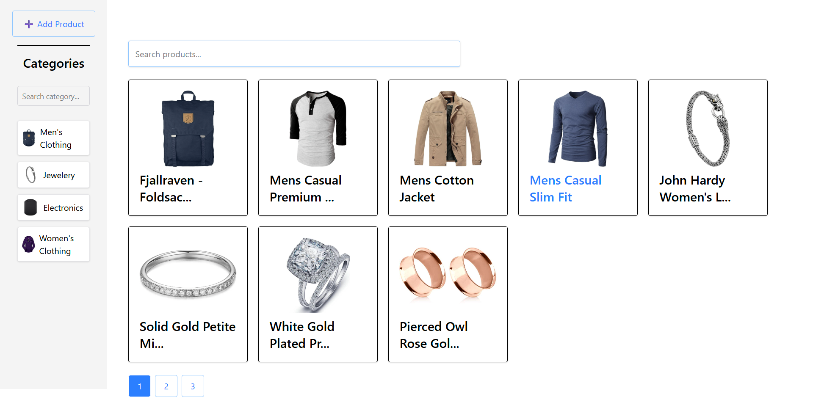
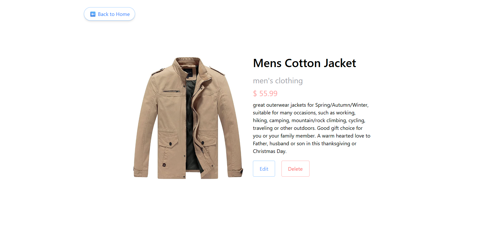
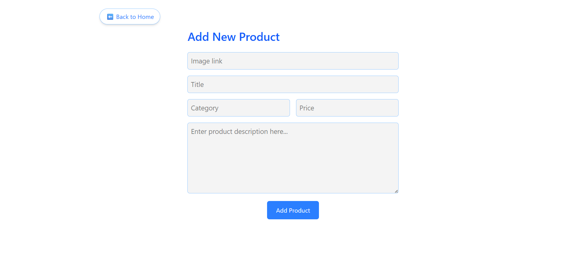

# 🛍️ React Product Manager App

A responsive and fully functional product management dashboard built with **React + TailwindCSS**, allowing users to:

- 🔍 View and filter products by category
- ➕ Add new products
- 📝 Edit product details
- 🗑️ Delete products (with confirmation)
- 🔄 Persist data using localStorage
- 💡 Intelligent category thumbnails pulled from actual product data
- 🔎 Debounced category search for improved UX

---

## ✨ Features

- 📦 Product list with image, title, category, and price
- 🔍 Category filter with dynamic thumbnails
- 🧠 Smart debounced category search
- 🖼️ Responsive design for desktop, tablet, and mobile
- 🔧 Edit + Delete product options with live feedback using Toast
- 💾 LocalStorage-powered state persistence

---

## 🔧 Tech Stack

- React (with Context API)
- Tailwind CSS
- React Router
- React Toastify
- LocalStorage API
- FakeStoreAPI (for initial product population)

---

## 📸 Screenshots

| Home Page                             | Product Details                         | Create Product                        |
|--------------------------------------|----------------------------------------|--------------------------------------|
|         |      |     |

---

## 🚀 Getting Started

```bash
git clone https://github.com/pratikkrsaurav/product-manager.git
cd product-manager
npm install
npm run dev
